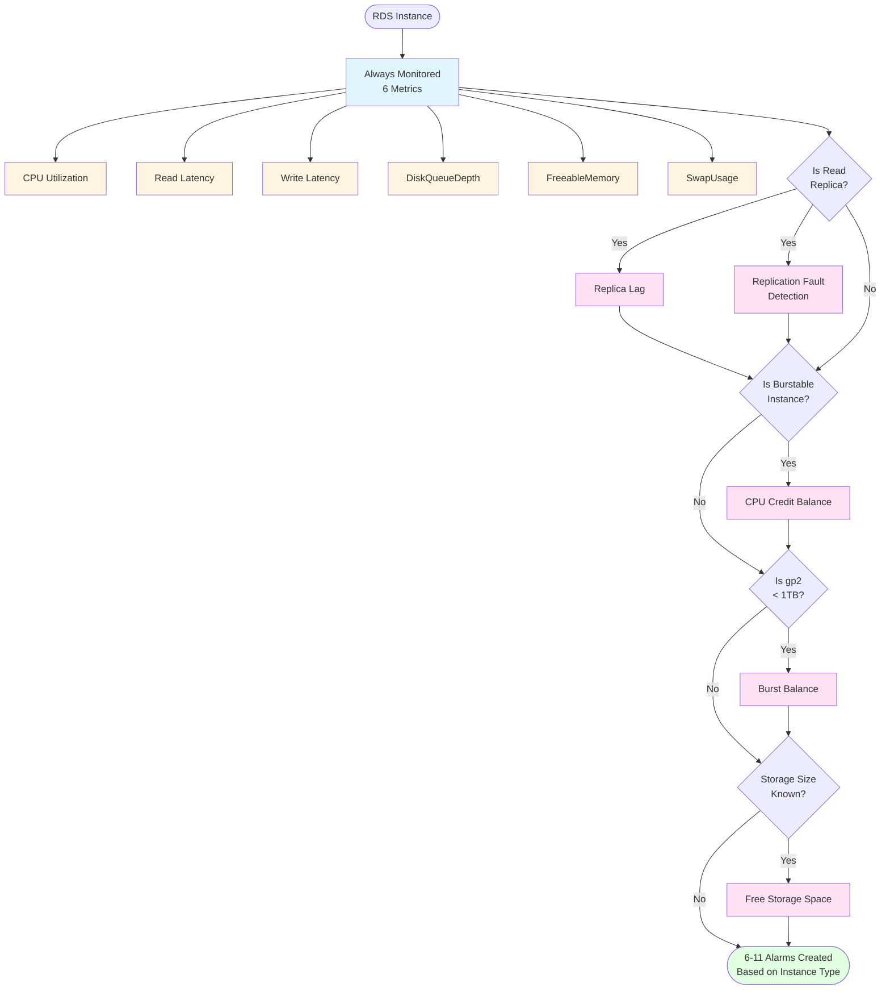

# RDS Alarms

This module creates CloudWatch alarms for RDS instances.

Each supported metric can be given two thresholds. The first threshold will trigger a "low priority" alarm. This is intended for early notification of unusual system behavior or known potential issues, such as running out of database capacity. The second threshold will trigger a "high priority" alarm. This is intended for situations which require immediate attention and may indicate that downtime of the ElastiCache cluster or services using the cluster is imminent.

## Requirements

| Name | Version |
|------|---------|
| <a name="requirement_terraform"></a> [terraform](#requirement\_terraform) | >= 1.5.0 |
| <a name="requirement_aws"></a> [aws](#requirement\_aws) | >= 4, < 7 |

### Tested Versions

This module is actively tested against the following versions in CI:

- **Terraform:** 1.5.7, 1.7.5, 1.9.8, 1.11.4, 1.13.4, and latest (currently 1.14.x)
- **AWS Provider:** 4.x, 5.x, and 6.x (tested via `test-all-versions.sh`)

### Support Policy

We support Terraform and AWS Provider versions from the **previous 2 years** of releases:

- **Terraform:** Currently supports 1.5.0+ (June 2023) through latest
- **AWS Provider:** Currently supports 4.x (April 2023) through 6.x

While we specify minimum versions, we actively test and validate compatibility with the versions listed above. Older versions may work but are not officially validated. Newer versions should work due to our use of stable Terraform/AWS features, but are validated as they release.

This policy aligns with HashiCorp's 2-year general availability support window and ensures compatibility with modern Terraform workflows while maintaining stability.

## Examples

See the [examples/](examples/) directory for complete, working configurations:

- **[minimal/](examples/minimal/)** - Production-ready starter with essential alarms (CPU, latency, storage)
- **[replica-monitoring/](examples/replica-monitoring/)** - Read replica with lag and fault detection
- **[performance-monitoring/](examples/performance-monitoring/)** - Advanced monitoring with p99 latency tracking
- **[burstable-instance/](examples/burstable-instance/)** - T3/T4g instances with CPU credit balance monitoring
- **[complete/](examples/complete/)** - All features enabled (reference configuration)

Each example includes `README.md`, `main.tf`, `variables.tf`, and `terraform.tfvars.example` for quick deployment.

## Installation

This is a complete example of a minimal set of alarms.

```hcl
provider "aws" {}

variable "db_instance_identifier" {
  type        = string
  description = "The identifier of a RDS DB instance."
}

data "aws_db_instance" "instance" {
  db_instance_identifier = var.db_instance_identifier
}

module "alarms" {
  source = "cloudomat/rds_alarms/aws"

  db_instance = data.aws_db_instance.instance

  low_priority_alarm  = []
  high_priority_alarm = []
}
```

## Built-in Metrics

This module monitors **11 built-in RDS CloudWatch metrics**. Each metric supports dual-threshold alarming (warning + critical).

### Always Monitored (All Instances)

#### CPU Utilization
Monitors CPU usage percentage.
- Variables: `cpu_utilization_high_threshold`, `cpu_utilization_vhigh_threshold`
- Example: Warn at 80%, critical at 95%

#### Read Latency
Monitors average read operation latency in milliseconds.
- Variables: `read_latency_high_threshold`, `read_latency_vhigh_threshold`
- Example: Warn at 20ms, critical at 50ms

#### Write Latency
Monitors average write operation latency in milliseconds.
- Variables: `write_latency_high_threshold`, `write_latency_vhigh_threshold`
- Example: Warn at 20ms, critical at 50ms

#### DiskQueueDepth *(New in v0.3.0)*
Monitors the number of outstanding I/O requests waiting to access the disk.
- Variables: `disk_queue_depth_high_threshold`, `disk_queue_depth_vhigh_threshold`
- Purpose: Detects I/O bottlenecks and storage performance issues
- Example: Warn at 64, critical at 128

#### FreeableMemory *(New in v0.3.0)*
Monitors available RAM in megabytes.
- Variables: `freeable_memory_low_threshold`, `freeable_memory_vlow_threshold`
- Purpose: Detects memory pressure and potential OOM conditions
- Example: Warn at 1024MB (1GB), critical at 512MB
- Note: Uses "low" directionality (alarms when below threshold)

#### SwapUsage *(New in v0.3.0)*
Monitors swap space usage in megabytes.
- Variables: `swap_usage_high_threshold`, `swap_usage_vhigh_threshold`
- Purpose: Detects memory swapping issues and performance degradation
- Example: Warn at 512MB, critical at 1024MB (1GB)

### Conditionally Monitored

#### Free Storage Space (when storage size is known)
Monitors available storage as a percentage of allocated storage.
- Variables: `free_storage_space_percentage_low_threshold`, `free_storage_space_percentage_vlow_threshold`
- Example: Warn at 20%, critical at 10%
- Note: Only created when module can determine allocated storage size

#### Burst Balance (for gp2 storage < 1TB)
Monitors I/O credit balance for gp2 volumes under 1TB.
- Variables: `burst_balance_low_threshold`, `burst_balance_vlow_threshold`
- Example: Warn at 50%, critical at 20%
- Note: Only applies to gp2 storage type with allocated storage < 1000 GB

#### CPU Credit Balance (for T3/T4g instances)
Monitors CPU credit balance for burstable instances.
- Variables: `cpu_credit_balance_low_threshold`, `cpu_credit_balance_vlow_threshold`
- Example: Warn at 200 credits, critical at 100 credits
- Note: Only applies to db.t3.* and db.t4g.* instance classes

#### Replica Lag (for read replicas only)
Monitors replication lag in seconds.
- Variables: `replica_lag_high_threshold`, `replica_lag_vhigh_threshold`
- Example: Warn at 60s, critical at 300s
- Note: Only created for read replica instances

#### Replication Fault Detection (for read replicas only)
Detects when replication has stopped completely.
- Variable: `replication_fault` (boolean, default: false)
- Purpose: Alerts when the ReplicaLag metric stops reporting
- Note: Only created for read replica instances

### Setting Thresholds

All threshold variables default to `null` (disabled). To enable monitoring for a metric, set at least one threshold:

```hcl
module "alarms" {
  source = "cloudomat/rds_alarms/aws"

  db_instance = data.aws_db_instance.instance

  # Enable CPU monitoring
  cpu_utilization_high_threshold  = 80   # Warning
  cpu_utilization_vhigh_threshold = 95   # Critical

  # Enable memory monitoring (new in v0.3.0)
  freeable_memory_low_threshold  = 1024  # 1GB warning
  freeable_memory_vlow_threshold = 512   # 512MB critical

  # Enable I/O monitoring (new in v0.3.0)
  disk_queue_depth_high_threshold  = 64
  disk_queue_depth_vhigh_threshold = 128
}
```

### Alarm Selection Flowchart

The module intelligently selects which alarms to create based on your RDS instance characteristics:



**How many alarms will be created for my instance?**

- **Standard instance (e.g., db.m6i.large, gp3)**: 6 alarms (always-monitored metrics only)
- **Read replica (e.g., db.m6i.large replica)**: 8 alarms (+replica lag, +replication fault detection)
- **Burstable instance (e.g., db.t3.medium, db.t4g.large)**: 7 alarms (+CPU credit balance)
- **Small gp2 instance (e.g., db.m5.large with 500GB gp2)**: 7 alarms (+burst balance)
- **Burstable replica with gp2 (e.g., db.t3.small replica, 800GB gp2)**: 10 alarms (all conditionals apply)

**Note**: Burstable instances include all T-series instance classes: db.t2.*, db.t3.*, and db.t4g.*

All instances also get **Free Storage Space** monitoring when the module can determine the allocated storage size.

## Custom Alarms

In addition to the built-in alarms for common RDS metrics, you can define custom alarms for any CloudWatch metric using the `custom_alarms` variable.

### Basic Usage

```hcl
module "alarms" {
  source = "cloudomat/rds_alarms/aws"

  db_instance = data.aws_db_instance.instance

  low_priority_alarm  = [aws_sns_topic.alerts_low.arn]
  high_priority_alarm = [aws_sns_topic.alerts_high.arn]

  # Built-in alarms
  cpu_utilization_high_threshold  = 80
  cpu_utilization_vhigh_threshold = 95

  # Custom alarms
  custom_alarms = {
    "connection_availability" = {
      metric_name    = "DatabaseConnections"
      low_threshold  = 20   # Warning when too few connections
      vlow_threshold = 10   # Critical when too few connections
      description    = "Database Connections"
      unit           = " connections"
    }
  }
}
```

### Bidirectional Alarming

You can alarm on both high AND low values for the same metric, useful for detecting both overload and unavailability:

```hcl
custom_alarms = {
  "connection_health" = {
    metric_name     = "DatabaseConnections"
    high_threshold  = 1000  # Warning when too many connections
    vhigh_threshold = 1500  # Critical when too many connections
    low_threshold   = 20    # Warning when too few connections
    vlow_threshold  = 10    # Critical when too few connections
    description     = "Database Connections"
    unit            = " connections"
  }
}
```

This creates 4 separate alarms:
- Warning when > 1000 connections (low priority)
- Critical when > 1500 connections (high priority)
- Warning when < 20 connections (low priority)
- Critical when < 10 connections (high priority)

### Available Options

- `metric_name` (required): The CloudWatch metric name (e.g., "DatabaseConnections", "NetworkReceiveThroughput")
- `high_threshold`: Low priority alarm when metric > threshold
- `vhigh_threshold`: High priority alarm when metric > threshold
- `low_threshold`: Low priority alarm when metric < threshold
- `vlow_threshold`: High priority alarm when metric < threshold
- `description`: Human-readable name for the alarm (defaults to metric name)
- `unit`: Unit suffix for alarm descriptions (e.g., "ms", "%", " connections")
- `statistic`: CloudWatch statistic (default: "Average") - conflicts with `extended_statistic`
- `extended_statistic`: *(New in v0.4.0)* Percentile metric (e.g., "p50", "p95", "p99") - conflicts with `statistic`
- `period`: Evaluation period in seconds (default: 300)
- `evaluation_periods`: Number of periods before alarming (default: 1)
- `treat_missing_data`: *(New in v0.4.0)* How to handle missing data: "missing" (default), "ignore", "breaching", "notBreaching"

All custom alarms automatically use the AWS/RDS namespace and include the DBInstanceIdentifier dimension.

### Extended Statistics (v0.4.0+)

Use percentile metrics for more accurate performance monitoring:

```hcl
custom_alarms = {
  "p99_read_latency" = {
    metric_name        = "ReadLatency"
    extended_statistic = "p99"              # 99th percentile
    vhigh_threshold    = 0.100              # 100ms in seconds
    description        = "p99 Read Latency"
    treat_missing_data = "notBreaching"     # Don't alarm during maintenance
  }
}
```

See [examples/performance-monitoring](examples/performance-monitoring/) for a complete example.

## Upgrading from 0.x to 1.0

### Summary

Version 1.0 is **fully backward compatible** with v0.2.1. You can upgrade without making any changes to your existing configuration.

### What's New

**v0.3.0 Features:**
- **3 New Built-in Metrics**: DiskQueueDepth, FreeableMemory, SwapUsage
- **Custom Alarms Support**: Define alarms for any RDS CloudWatch metric
- **AWS Provider v6 Support**: Now supports AWS Provider 4.x, 5.x, and 6.x

**v0.4.0 Features:**
- **Extended Statistics**: Use percentiles (p50, p95, p99) for custom alarms
- **treat_missing_data**: Control alarm behavior during maintenance windows

### Migration Steps

1. **Update module version** in your Terraform configuration:

```hcl
module "rds_alarms" {
  source  = "cloudomat/rds_alarms/aws"
  version = "~> 1.0"  # Update from "~> 0.2"

  # Your existing configuration works as-is
  db_instance = data.aws_db_instance.instance
  # ... rest of your config
}
```

2. **Run Terraform plan** to see what will change:

```bash
terraform plan
```

You should see **no changes** to your existing alarms if you haven't added any new threshold variables.

3. **Apply the upgrade**:

```bash
terraform apply
```

### Optional: Enable New Features

After upgrading, you can optionally enable the new metrics:

```hcl
module "rds_alarms" {
  source  = "cloudomat/rds_alarms/aws"
  version = "~> 1.0"

  db_instance = data.aws_db_instance.instance

  # Your existing thresholds continue to work
  cpu_utilization_high_threshold = 80

  # NEW in v0.3.0: Enable memory monitoring
  freeable_memory_low_threshold  = 1024  # 1GB warning
  freeable_memory_vlow_threshold = 512   # 512MB critical

  # NEW in v0.3.0: Enable I/O monitoring
  disk_queue_depth_high_threshold  = 64
  disk_queue_depth_vhigh_threshold = 128

  # NEW in v0.3.0: Enable swap monitoring
  swap_usage_high_threshold  = 512   # 512MB warning
  swap_usage_vhigh_threshold = 1024  # 1GB critical
}
```

Or use custom alarms for advanced monitoring:

```hcl
module "rds_alarms" {
  source  = "cloudomat/rds_alarms/aws"
  version = "~> 1.0"

  db_instance = data.aws_db_instance.instance

  # NEW in v0.3.0: Custom alarms for any metric
  custom_alarms = {
    "p99_latency" = {
      metric_name        = "ReadLatency"
      extended_statistic = "p99"  # NEW in v0.4.0
      vhigh_threshold    = 0.100  # 100ms
      treat_missing_data = "notBreaching"  # NEW in v0.4.0
    }
  }
}
```

### Validation

After upgrading, verify your alarms are working:

1. **Check CloudWatch console**: Ensure all expected alarms are present
2. **Review alarm history**: Verify no unexpected state changes occurred
3. **Test notifications**: Confirm SNS topics are receiving alarm notifications

### Breaking Changes

**None!** Version 1.0 maintains full backward compatibility with v0.2.1.

All new variables default to `null` (disabled), so existing configurations continue to work unchanged.

### Need Help?

- See [examples/](examples/) for working configurations
- Check [CHANGELOG.md](CHANGELOG.md) for detailed release notes
- Review the [Built-in Metrics](#built-in-metrics) section for new monitoring options
